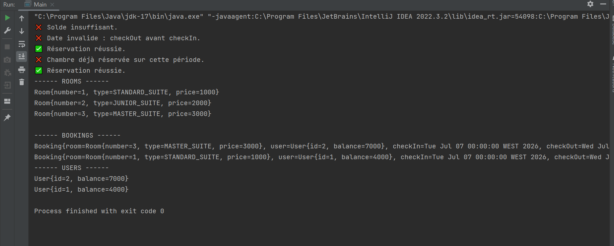

#  Système simplifié de réservation d'hôtel (Technical Test 2)

##  Description du projet :   
Ce projet implémente un système simplifié de réservation d’hôtel en Java.  
Il gère trois entités principales : Room (chambre), User (utilisateur) et Booking (réservation).  

##  Les fonctionnalités principales sont :  

Création de chambres avec un type et un prix par nuit.  

Création d’utilisateurs avec un solde.  

Réservation d’une chambre pour une période donnée, sous condition de disponibilité et de solde suffisant.  

Affichage de toutes les chambres, réservations et utilisateurs.  
## printAll(...) et printAllUsers(...) :   
  

##  1/ Mettre toutes les fonctions dans un même service est-il recommandé ?  
Mettre toutes les fonctions dans un seul service (monolithe) n’est généralement pas recommandé, surtout pour des projets qui peuvent évoluer ou devenir complexes.
Cela crée un service aux responsabilités multiples, ce qui rend le code :  

-  Plus difficile à maintenir, comprendre et tester (manque de séparation des responsabilités).  

-  Plus fragile, car un changement dans une fonctionnalité peut impacter d’autres parties.  

-  Moins réutilisable et moins modulaire.  

###  Bonne pratique :  
Il vaut mieux appliquer le principe de responsabilité unique (Single Responsibility Principle) en séparant la logique en plusieurs services spécialisés, par exemple :  

-  UserService pour gérer les utilisateurs,

-  RoomService pour gérer les chambres,

-  BookingService pour gérer les réservations.  

Cela améliore la clarté, facilite les tests unitaires, et rend le code plus évolutif.  
  
##  2/ La fonction setRoom(...) ne doit pas impacter les réservations précédentes. Quelle autre approche ? Quelle recommandation ?  

Dans cette conception, on empêche que la modification d’une chambre (ex: son prix) modifie rétroactivement les réservations déjà faites, pour garder la cohérence historique.  

##  Autres approches possibles :
### Système de versioning des chambres :

Chaque modification crée une nouvelle version de la chambre (ex : même numéro mais version différente).

Les anciennes réservations restent liées à la version de chambre utilisée au moment de la réservation, garantissant ainsi l’intégrité des données historiques.

### Chambre immuable :

Considérer la chambre comme une entité immuable.

Au lieu de modifier une chambre existante, créer une nouvelle chambre avec un nouvel identifiant pour chaque changement. 
